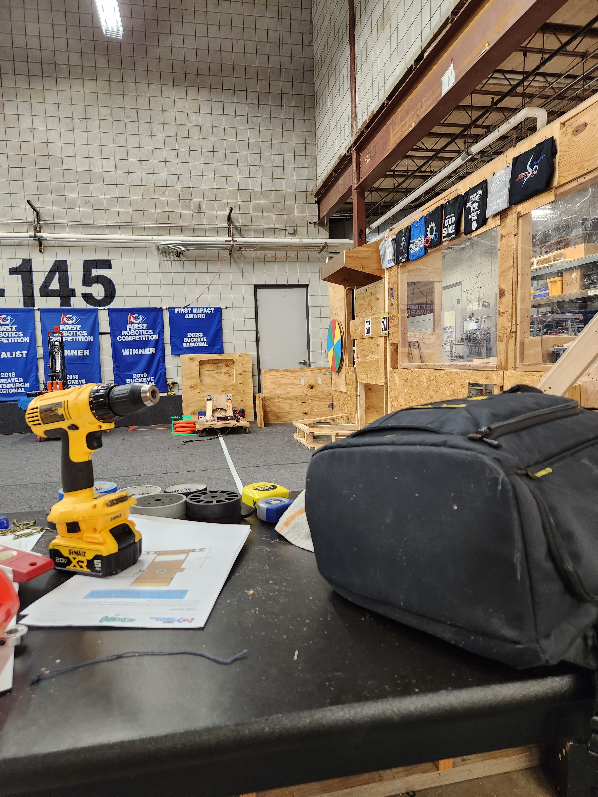

# 4145 FRC - 2024 AI Vision  
<a href="https://universe.roboflow.com/raleigh-slack-idx6f/2024-frc/model/">
    </img>
</a>
<a href="https://universe.roboflow.com/raleigh-slack-idx6f/2024-frc">
    </img>
</a>  

AI Vision for the 2024 game Crescendo by the WorBots 4145. Using a YOLOv8 model with a custom data set to detect notes, other robots and various other field elements. Expect consistent updates throughout the season. The ONNX model can be found under `/models`, and can be tested with the main.py file to predict on an image. 
